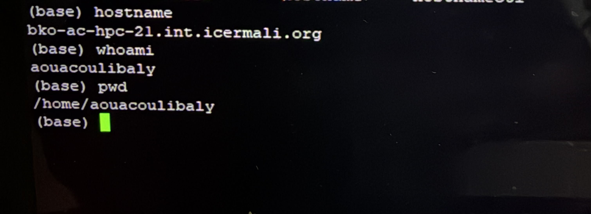

# Accounts and Login

This section provides guidance for accessing the ACE Mali HPC and troubleshooting common account and login issues.

## HPC Account

Users must have an authorized HPC account before accessing the system.

If you do not have an HPC account, are unsure whether your account has been activated, or need assistance with account access, contact the ACE Mali HPC support team:

**Email:** [support@ace-bioinformatics.org](mailto:support@ace-bioinformatics.org)

## Connecting to the HPC

The method used to connect to the ACE Mali HPC depends on whether you are connected to the ICERMALI network or accessing the system remotely.

### Access from the ICERMALI Network

Users connected to the ICERMALI network can access the HPC directly using SSH.

Use:

```bash
ssh USERNAME@hpc.icermali.org
```

Replace USERNAME with your HPC username.

### Remote Access

Users outside the ICERMALI network cannot connect directly to the HPC using SSH. They must first connect to the approved remote environment.

Remote access instructions are available for both Windows and Mac users.

#### Windows Users

Windows users should follow the **ACE Mali HPC Windows Remote Access Guide** to establish the remote connection.

Once connected to the remote environment, users can access the HPC using their HPC account.

#### Mac Users

Mac users should use **Windows App** to establish the remote connection.

Users should follow the **ACE Mali HPC Mac Remote Access Guide** for instructions on configuring Windows App and establishing the remote connection.

Once connected to the remote environment, users can access the HPC using their HPC account.

### Verifying Your HPC Connection

After connecting to the HPC, you can verify your connection and current working directory using:

```bash
hostname
whoami
pwd
```

A successful connection should display the HPC hostname, your username, and your home directory.

Example:


## Common Login and Account Issues

### I cannot connect to the HPC from the ICERMALI network

Check that:

- You are connected to the ICERMALI network.
- Your HPC account is active.
- You are using the correct username.
- You are connecting to hpc.icermali.org.

If the problem persists, contact the ACE Mali HPC support team.

### I cannot establish a remote connection

Check that:

- Your internet connection is working.
- You are using the correct remote access credentials.
- You are following the appropriate remote access instructions for your operating system.
- The required remote access application is correctly configured.

If the problem persists, contact the ACE Mali HPC support team.

### I can connect remotely, but I cannot access the HPC

Check that:

- Your HPC account is active.
- You are using the correct HPC username.
- You have successfully established the remote connection.

If the problem continues, contact the ACE Mali HPC support team.

### My password is not accepted

Check that you are using the correct username and password.

If you have forgotten your password or your credentials are no longer working, contact the ACE Mali HPC support team for assistance.

Do not share your password or include it in a support request.

### I can log in, but I cannot access my home directory

Check your home directory using:

```bash
echo $HOME
```

You can also check whether the directory exists and is accessible:

```bash
ls -ld $HOME
```

If your home directory is unavailable or you receive a permission error, contact the ACE Mali HPC support team.

### How do I check my user and group information?

Use:

```bash
id
```

This command displays your user ID (UID), group ID (GID), and group memberships.

If your username or group information cannot be resolved correctly, contact the ACE Mali HPC support team.

## Reporting a Login or Account Problem

If you are unable to resolve the issue, contact:

**Email:** [support@ace-bioinformatics.org](mailto:support@ace-bioinformatics.org)

When reporting a problem, provide:

- Your username
- Whether you are connecting from the ICERMALI network or remotely
- Whether you are using Windows or Mac
- The date and time the problem occurred
- The error message received
- A brief description of the problem

Do not send your password by email or include it in a support request.

## Additional Documentation

For detailed remote access setup instructions, refer to:

- ACE Mali HPC Remote Access Guide for Windows
- ACE Mali HPC Remote Access Guide for Mac

For other HPC-related problems, see the [Troubleshooting](../troubleshooting/README.md) section.