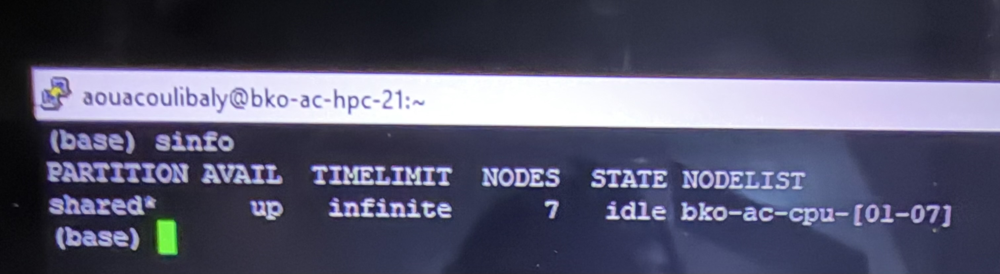
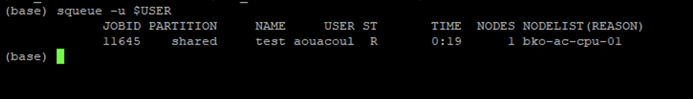
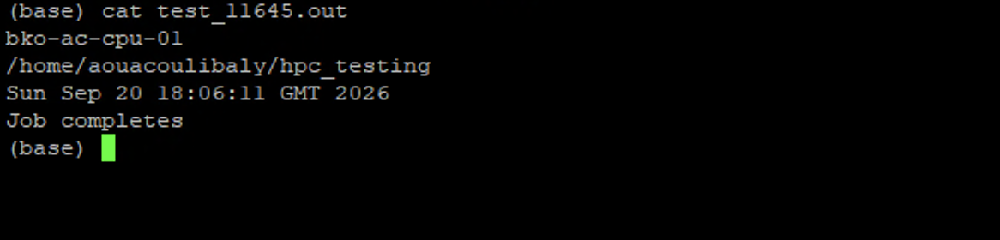

# SLURM Job Submission and Troubleshooting

This section provides guidance for submitting, monitoring, and troubleshooting jobs on the ACE Mali HPC.

Computational workloads should be submitted to the compute nodes using SLURM rather than run directly on the head/login node.

## Checking Available Compute Nodes

Before submitting a job, you can check the status of the compute nodes using:

```bash
sinfo
```
The output shows the available partition, number of nodes, their current state, and the node list.

For example, nodes shown as `idle` are currently available to accept jobs.

Example:



For more detailed information:

```bash
sinfo -N -l
```
You can also view detailed information about a specific node:

```bash
scontrol show node NODE_NAME
```

## Submitting a SLURM Job

SLURM jobs are submitted using a job script.

Example:

```bash
#!/bin/bash

#SBATCH --job-name=test_job
#SBATCH --output=test_job_%j.out
#SBATCH --error=test_job_%j.err
#SBATCH --time=00:10:00
#SBATCH --cpus-per-task=1
#SBATCH --mem=1G

echo "Job started on:"
hostname

echo "Job completed."
```

Save the script, for example, as:

```bash
test_job.sh
```

Submit it using:

```bash
sbatch test_job.sh
```

If the job is successfully submitted, SLURM will return a job ID.

Example of a successful job submission:


## Checking Job Status

To view your jobs:

```bash
squeue -u $USER
```

The ST column shows the current state of the job. For example, R indicates that the job is running.

Example:



Common job states include:

- R – Running
- PD – Pending
- CG – Completing

For detailed information about a job:

```bash
scontrol show job JOB_ID
```

Replace JOB_ID with the SLURM job ID.

## Cancelling a Job

To cancel a job:

```bash
scancel JOB_ID
```

## Checking Job Output

After the job runs, check the output and error files specified in the SLURM script.

In the example job script, `%j` is automatically replaced by SLURM with the job ID.

For example, if the job ID is `12345`, the output and error files will be:

```bash
test_job_12345.out
test_job_12345.err
```

You can view the files using:

```bash
cat test_job_12345.out
cat test_job_12345.err
```

A successful output file contains the results produced by the job.

Example:



If the error file is empty, no error messages were written by the job.

## Troubleshooting Common Job Submission Problems

### The job is pending

Check the job status:

```bash
squeue -u $USER
```

A job may remain pending if the requested resources are not currently available.

For additional information:

```bash
scontrol show job JOB_ID
```

Look for the reason the job is pending.

### The job failed

Check the output and error files generated by the job.

Also verify:

- Input file paths are correct.
- Required files exist.
- The requested software is available.
- The correct module or Conda environment is loaded.
- The requested memory and CPU resources are appropriate.
- You have permission to access the required files and directories.

### The job completed but no output file was generated

First check the job status:

```bash
scontrol show job JOB_ID
```

Then check the output and error paths specified in the SLURM script.

Verify that:

- The output directory exists.
- You have write permission to the output directory.
- The compute node can access the required directory.
- The script is writing output to the expected location.

### My files are accessible on the login node but not from the compute node

Check whether the required directory is accessible from the compute node.

For example:

```bash
srun hostname
```

If files or your home directory are available on the login node but unavailable from compute nodes, this may indicate a filesystem or account configuration issue.

Contact the ACE Mali HPC support team:

**Email:** [support@ace-bioinformatics.org](mailto:support@ace-bioinformatics.org)

### The software works interactively but fails in my SLURM job

Make sure the required software environment is also initialized inside your SLURM script.

For example, if using a module:

```bash
module load SOFTWARE_MODULE
```

If using Conda, make sure the appropriate Conda environment is activated before running the analysis.

Check the SLURM error file for additional information.

## Information to Provide When Reporting a Job Problem

If you cannot resolve the problem, contact the ACE Mali HPC support team and provide:

- Your username
- Job ID
- Job script
- SLURM output and error messages
- Command or software being used
- Brief description of the problem

**Email:** [support@ace-bioinformatics.org](mailto:support@ace-bioinformatics.org)

Do not include passwords or other credentials in a support request.

## Related Documentation

For account and login problems, see the [Accounts and Login](../accounts-login/README.md) section.

For additional HPC issues, see the [Troubleshooting](../troubleshooting/README.md) section.

For information about software modules and Conda environments, see the [Software and Conda Environments](../software/README.md) section.