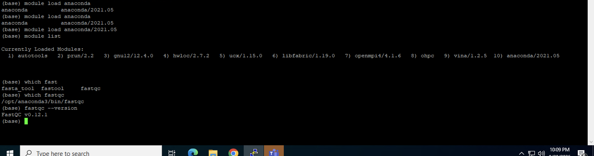

# Software Modules and Conda Environments

This section explains how to access software available on the ACE Mali HPC and how to create and manage personal Conda environments.

The ACE Mali HPC uses environment modules to provide access to installed software environments. The Anaconda module provides access to a collection of software tools that can be called directly once the module is loaded.

Users should not attempt to modify the system-wide software installation. Additional software should be installed within a user's own Conda environment when needed.

## Checking Available Modules

To view the modules available on the HPC:

```bash
module avail
```

To view the modules currently loaded in your environment:

```bash
module list
```

## Loading Anaconda

To access the software available through Anaconda, load the Anaconda module:

```bash
module load anaconda/2021.05
```

Once Anaconda is loaded, software available within the environment can be called directly from the command line.

For example, to check whether FastQC is available:

```bash
which fastqc
```

To check the FastQC version:

```bash
fastqc --version
```

To run FastQC on a FASTQ file:

```bash
fastqc sample.fastq.gz
```

If FastQC is already available through the loaded Anaconda environment, there is no need to load a separate FastQC module.

Example:




## Checking Whether Software Is Available

After loading Anaconda, you can check whether a particular program is available using:

```bash
which SOFTWARE_NAME
```

For example:

```bash
which fastqc
```

If the software is available, the command will return the path to the program.

You can also check the software version when supported:

```bash
SOFTWARE_NAME --version
```

Recording software versions used during an analysis is recommended for reproducibility.

## Unloading Modules

To unload the Anaconda module:

```bash
module unload anaconda/2021.05
```

To unload all currently loaded modules:

```bash
module purge
```

## Using Conda Environments

Users who require additional software or specific software versions can create their own Conda environments.

First, load Anaconda:

```bash
module load anaconda/2021.05
```

To view available Conda environments:

```bash
conda env list
```

## Creating a Conda Environment

To create a new Conda environment:

```bash
conda create -n ENVIRONMENT_NAME
```

For example:

```bash
conda create -n bioinfo_env
```

Activate the environment:

```bash
conda activate bioinfo_env
```

Replace `bioinfo_env` with the name of your environment.

## Installing Software in a Conda Environment

Once your Conda environment is activated, you can install additional software within that environment.

For example:

```bash
conda install PACKAGE_NAME
```

Packages can also be installed from appropriate Conda channels such as Bioconda or conda-forge.

For example:

```bash
conda install -c bioconda fastqc
```

After installation, verify that the software is available:

```bash
which fastqc
```

and:

```bash
fastqc --version
```

Users should install additional software within their own Conda environments rather than attempting to modify the system-wide Anaconda environment.

Newly installed software should be tested with a small dataset or test job before being used for large analyses.

## Deactivating a Conda Environment

When you have finished using an environment:

```bash
conda deactivate
```

## Removing a Conda Environment

If an environment is no longer required:

```bash
conda env remove -n ENVIRONMENT_NAME
```

Replace `ENVIRONMENT_NAME` with the name of the environment you want to remove.

## Using Software in a SLURM Job

Software required for an analysis should also be made available within the SLURM job script.

For example, a FastQC job can load Anaconda before running FastQC:

```bash
#!/bin/bash

#SBATCH --job-name=fastqc_test
#SBATCH --output=fastqc_%j.out
#SBATCH --error=fastqc_%j.err
#SBATCH --time=00:30:00
#SBATCH --cpus-per-task=2
#SBATCH --mem=2G

module load anaconda/2021.05

fastqc sample.fastq.gz
```

In this example, Anaconda is loaded within the job and FastQC is then called directly.

Users should test software with a small SLURM job before submitting large analyses.

For detailed information about submitting jobs, see the [SLURM Job Submission and Troubleshooting](../slurm/README.md) section.

## Using a Personal Conda Environment in a SLURM Job

If your analysis requires software installed in your own Conda environment, the required environment must be available to the job before the analysis is run.

First, load Anaconda:

```bash
module load anaconda/2021.05
```

Then activate the required environment before running the analysis.

Because Conda activation within batch jobs may depend on the HPC configuration, users should verify their environment with a small test job before running a large analysis.

If the environment does not activate correctly within a SLURM job, contact HPC support.

## Common Software Issues

### The software command is not found

First, confirm that Anaconda has been loaded:

```bash
module list
```

If Anaconda is not listed, load it:

```bash
module load anaconda/2021.05
```

Then check whether the software is available:

```bash
which SOFTWARE_NAME
```

If the required software is not available, you may need to install it within your own Conda environment or contact HPC support.

### My Conda environment does not activate

Confirm that Anaconda has been loaded:

```bash
module load anaconda/2021.05
```

Check the available environments:

```bash
conda env list
```

Confirm that the environment exists and that you are using the correct environment name.

### Software works from the command line but fails in my SLURM job

Check that Anaconda or the required software environment is also loaded within the SLURM job script.

Review the SLURM output and error files for additional information.

For additional job troubleshooting, see the [SLURM Job Submission and Troubleshooting](../slurm/README.md) section.

## Software Support

If you need assistance with software, Conda environments, or software installation, contact the ACE Mali HPC support team:

**Email:** [support@ace-bioinformatics.org](mailto:support@ace-bioinformatics.org)

When requesting assistance, provide:

- Software or package name
- Required version, if applicable
- Conda environment name, if applicable
- Purpose or project requiring the software
- Error message, if applicable
- Brief description of the problem

Do not include passwords or other credentials in a support request.

## Related Documentation

For job submission and troubleshooting, see the [SLURM Job Submission and Troubleshooting](../slurm/README.md) section.

For storage-related issues, see the [Storage and Quota Troubleshooting](../storage/README.md) section.

For additional HPC issues, see the [Troubleshooting](../troubleshooting/README.md) section.